# Client

## 計測

以下は, 作者の手持ちのクライアント PC で計測してみた結果です.
クライアント PC なので, 特にユーザーが意図的に走らせているバックグラウンドプロセスはありません.
論理コア数も 16 あり, 計測が他のプロセスに邪魔されることも“比較的”少ないと思われる環境です.
もっとも Windows が“勝手”に走らせているバックグラウンドプロセス
( ウイルスチェックとかアップデートチェックとか )
も多々あるので, それほど厳密な計測ができるわけでもありませんが……

計測機諸元:

| 項目 | 内容 |
| --- | --- |
| 論理コア数 | 16 |
| ページングファイル | 無効 |
| グラフィック | 外付け |
| OS | Windows11 Pro 23H2 |

### 15ms

`15[ms]` という数字は Windows の ( デフォルトの ) タイマー分解能である `15.625[ms]` ( 1000/64[s] ) を下回る短さです.
なので, タイマー待ち受け中に他のプロセスが割り込んでくるスキがなく, タイマー処理自体はブレが少ないような気がするのですが……

`SetTimer` での計測結果: ( 各画像をクリックすると `Copy` したログが参照できます. )

| 
画像
 | 注釈 |
| --- | --- |
| [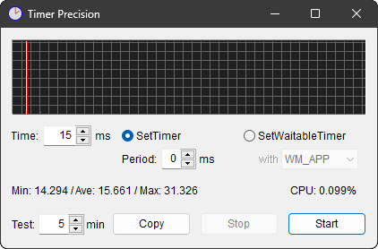](T15P0.txt) | `timeBeginPeriod` を呼ばなかった場合. なかなかがんばった方に見えます. |
| [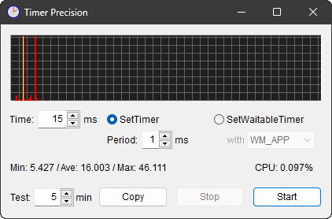](T15P1.txt) | `timeBeginPeriod(1)` とした場合. どうしたわけだか, かえってブレが増えています. |

`timeBeginPeriod(1)` とした場合にかえってブレるのが意外でしたが,
性能的にはゆとりのない  [Server](../Server/README.md#15ms) 機でも似たような傾向があるので,
タイマーハンドラーの応答性というより, `WM_TIMER` の到着時刻自体にブレが生じたように思えます.
1[ms] 単位で「ブレ先が増えた」と見れば良いんですかね.

`SetWaitbleTimer` での計測結果:

| 
画像
 | 注釈 |
| --- | --- |
| [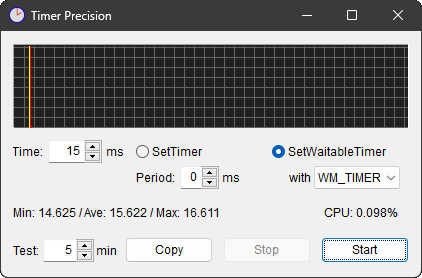](W15P0T.txt) | `WM_TIMER` で通知した場合. `SetTimer` より収束しています. |
| [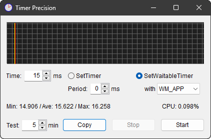](W15P0A.txt) | `WM_APP` で通知した場合. 上と全く同じ結果でした. |
| [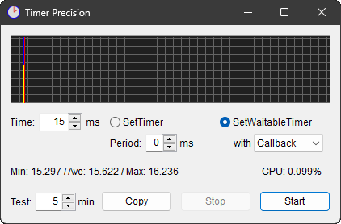](W15P0C.txt) | `Callback` とした場合. さらに収束しています. 他が割り込むスキがないのでしょう. |

`SetTimer` ではなく `SetWaitbleTimer` を選んだだけで, 如実にブレが減りました. もうこれでいいような気もしますが, いちおう `timeBeginPeriod(1)` を加えた結果も並べると:

| 
画像
 | 注釈 |
| --- | --- |
|  | `WM_TIMER` で通知した場合. `timeBeginPeriod(1)` でも大して違わないように見えますが, ±1[ms] のブレが生じています. |
|  | `WM_APP` で通知した場合. `timeBeginPeriod(1)` でも大して違わないように見えますが, ±1[ms] のブレが生じています. |
|  | `Callback` とした場合. `timeBeginPeriod(1)` でも大して違わないように見えますが, ±1[ms] のブレが生じています. |

とまあこんな感じで, `SetWaitbleTimer` でありさえすれば, `timeBeginPeriod` を呼ぶ／呼ばないは些細な問題のように見えます.
いや, むしろ `timeBeginPeriod` した方が ±1[ms] でブレが生じています. このタイマー値だと, `15.625[ms]` の周期に乗っておいた方がまだマシということでしょう.
CPU 使用率も微妙に増えているし.

### 16ms

`16[ms]` という数字は Windows の ( デフォルトの ) タイマー分解能である `15.625[ms]` ( 1000/64[s] ) を上回る長さです.
なので, タイマー待ち受け中に他のプロセスが割り込んでくるスキがあり, タイマー処理はブレるような気がするのですが……

`SetTimer` での計測結果:

| 
画像
 | 注釈 |
| --- | --- |
| [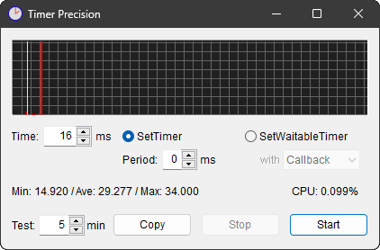](T16P0.txt) | `timeBeginPeriod` を呼ばなかった場合. 16[ms] のラインに乗った回数より, `15.625[ms]` 出遅れた 31[ms] や 32[ms] に流された回数の方が多い有様です. |
|  | `timeBeginPeriod(1)` とした場合. かえってブレが増えています. |

`timeBeginPeriod(1)` とした場合にかえってブレるのが意外でしたが,
「次の `15.625[ms]`」に限定されず, 1[ms] 単位で出遅れることができるからでしょうか.
「この便を逃したら次は `15.625[ms]` 後だ!」と詰めかける乗客と, 「この便を逃してもどうせ次は `1[ms]` 後だしぃ」と三々五々集まってくる乗客の違いを見るようです.

でも, `timeBeginPeriod` がなくて `15.625[ms]` 周期が強制されるはずの状況でも 1[ms] 単位のブレが生じているところを見ると
( 画像をクリックしてログを見ると判ります. ),
やはり `SetTimer` が届けてくれる `WM_TIMER` の到着時刻そのものがブレているような気がしますね.
運行がルーズな便のように見えます.
こんなことでは西村京太郎先生のトリックには使えません.

`SetWaitbleTimer` での計測結果:

| 
画像
 | 注釈 |
| --- | --- |
| [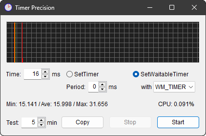](W16P0T.txt) | `WM_TIMER` で通知した場合. やはり「次の`15.625[ms]`」にある程度流れています. |
|  | `WM_APP` で通知した場合. 上と大して違いません. |
|  | `Callback` とした場合. 上と大して違いません. |

15[ms] では `timeBeginPeriod` なしでもブレなかった `SetWaitbleTimer` ですが, 16[ms] では「次の`15.625[ms]`」に流れる回数が出てきました.

この状況に対し, `timeBeginPeriod(1)` を加えてみると:

| 
画像
 | 注釈 |
| --- | --- |
|  | `WM_TIMER` で通知した場合. `timeBeginPeriod(1)` のお陰で ±1[ms] に収束しました. |
|  | `WM_APP` で通知した場合. `timeBeginPeriod(1)` のお陰で ±1[ms] に収束しました. |
|  | `Callback` とした場合. `timeBeginPeriod(1)` のお陰で ±1[ms] に収束しました. |

と, ブレが収まります.

15[ms] と 16[ms] では様相が変わります.
たった 1[ms] の差でこんなにも違います.

`15.625[ms]` を超えた分, 他のプロセスに割り込まれるスキが挟まってしまうからでしょう.
で, そんなスキがあったとしても, `timeBeginPeriod(1)` 付き `SetWaitbleTimer` なら, ±1[ms] の範囲に収束させてくれるわけです.

### 100ms

15[ms] や 16[ms] などという限界に近い値ではなく, もう少し常識的な数字として 100[ms] を試してみました.

`100[ms]` という数字は Windows の ( デフォルトの ) タイマー分解能である `15.625[ms]` ( 1000/64[s] ) で割り切れない
( 100÷15.625＝6.4 となるので余りが出る ) 数字なので, 狙った時間には命中しないような気がするのですが……

`SetTimer` での計測結果:

| 
画像
 | 注釈 |
| --- | --- |
| [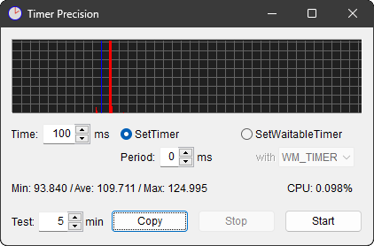](T100P0.txt) | `timeBeginPeriod` を呼ばなかった場合. 100[ms] のラインに 1回も命中しません. `15.625[ms]` x 7 = `109.375` ということで 109[ms] や 110[ms] にピークがあります. |
| [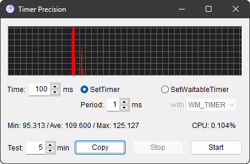](T100P1.txt) | `timeBeginPeriod(1)` とした場合. 上と同様ですが, 分解能が 1[ms] 単位になった分, 余計に散らかっています. |

`SetWaitbleTimer` での計測結果:

| 
画像
 | 注釈 |
| --- | --- |
| [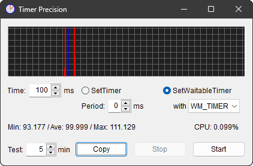](W100P0T.txt) | `WM_TIMER` で通知した場合. 「前後の`15.625[ms]`」に集中しています. |
|  | `WM_APP` で通知した場合. 上と大して違いません. |
| [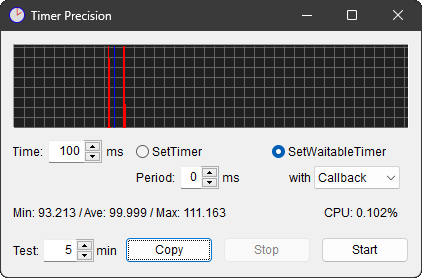](W100P0C.txt) | `Callback` とした場合. 上と大して違いません. |

正確なはずの `SetWaitbleTimer` でも, 100[ms] には一発も命中しまていせん. 
`15.625[ms]` x 6 = 93.750[ms] ≒ 94[ms] と `15.625[ms]` x 7 = 109.375[ms] ≒ 109[ms] の二つがピークです.

この状況に対し, `timeBeginPeriod(1)` を加えてみると:

| 
画像
 | 注釈 |
| --- | --- |
| [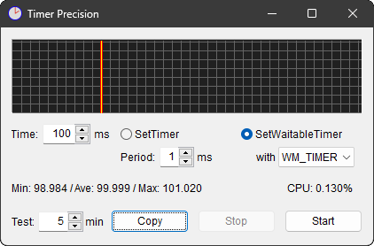](W100P1T.txt) | `WM_TIMER` で通知した場合. `timeBeginPeriod(1)` のお陰で ±1[ms] に収束しました. |
|  | `WM_APP` で通知した場合. `timeBeginPeriod(1)` のお陰で ±1[ms] に収束しました. |
|  | `Callback` とした場合. `timeBeginPeriod(1)` のお陰で ±1[ms] に収束しました. |

とまあこんな感じで, 16[ms] のときと同様, ±1[ms] の範囲に収束します.

### 125ms

100[ms] だと全然命中しないということで, 割り切れる数字として 125[ms] を試してみました.
この倍数である 250[ms], 500[ms], 1[s] も同様の状況となるでしょう.

`125[ms]` という数字は Windows の ( デフォルトの ) タイマー分解能である `15.625[ms]` ( 1000/64[s] ) で割り切れる
( 125÷15.625＝8 となるので余りが出ない ) 数字なので, 狙った時間に命中しやすいような気がするのですが……

`SetTimer` での計測結果:

| 
画像
 | 注釈 |
| --- | --- |
| [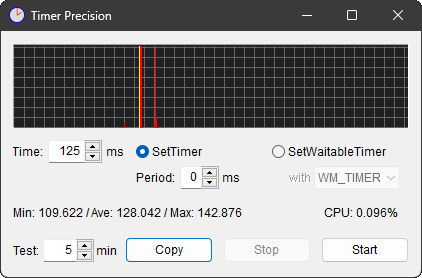](T125P0.txt) | `timeBeginPeriod` を呼ばなかった場合. 125[ms] がいちばん大きなピークですが, その `15.625[ms]` x 1 前に小さなピーク, `15.625[ms]` x 1 後にそれなりのピークが現われています. |
| [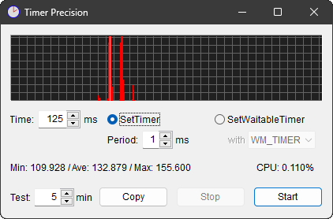](T125P1.txt) | `timeBeginPeriod(1)` とした場合. かえってブレが増えています. 上に加えて `15.625[ms]` x 2 後にも小さなピークが現われています. |

`SetWaitbleTimer` での計測結果:

| 
画像
 | 注釈 |
| --- | --- |
|  | `WM_TIMER` で通知した場合. 「前の`15.625[ms]`」にある程度流れています. 後には“ほとんど”流れていません. |
| [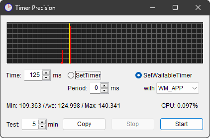](W125P0A.txt) | `WM_APP` で通知した場合. 上と大して違いません. |
|  | `Callback` とした場合. 上と大して違いません. |

`15.625[ms]` で割り切れる分, かなりの命中精度です.

この状況に対し, `timeBeginPeriod(1)` を加えてみると:

| 
画像
 | 注釈 |
| --- | --- |
| [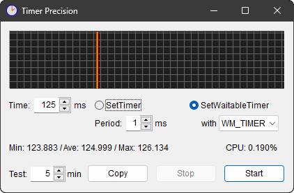](W125P1T.txt) | `WM_TIMER` で通知した場合. `timeBeginPeriod(1)` のお陰で ±1[ms] に収束しました. |
|  | `WM_APP` で通知した場合. `timeBeginPeriod(1)` のお陰で ±1[ms] に収束しました. |
| [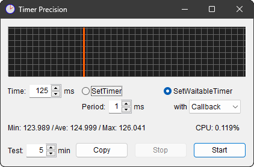](W125P1C.txt) | `Callback` とした場合. `timeBeginPeriod(1)` のお陰で ±1[ms] に収束しました. |

とまあこんな感じで, 他のタイマー値同様, ±1[ms] の範囲に収束します.

## 結論

これらの計測で判ったのは,

* `SetTimer` が届けてくれる `WM_TIMER` の届くタイミングがそもそもブレている.

* `SetWaitbleTimer` でも, タイマーのハンドラが動くのは `15.625[ms]` 周期に乗ったタイミングに限定される.

ということになります. そして

* デフォルトの「`15.625[ms]` 周期」をもっと細かく指定するのが `timeBeginPeriod`.

ということでしょう.

In-house Tool / 家中 徹

