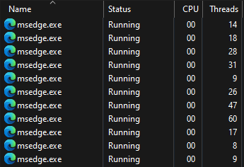

# Examples

## 実例

以下は, 作者の手持ちの PC で計測してみた結果です.
あくまで計測の実例としてお考えください.

### Client

論理コア数16の, 比較的[高性能な PC での計測結果](Client/README.md).

### Server

論理コア数4の, 比較的[低性能な PC での計測結果](Server/README.md).

※これらの計測は2024年10月現在の Windows で行われたものです.
次に[Windows が仕様を変える](https://randomascii.wordpress.com/2020/10/04/windows-timer-resolution-the-great-rule-change/)までは, 
まあまあ正しいはずです.

## 結果

上記の計測の結果, 見えた傾向は：

* 誤差を±15.625[ms] ( 1,000/64[s] ) 以内に収めたいのなら [`SetTimer`](https://learn.microsoft.com/en-us/windows/win32/api/winuser/nf-winuser-settimer) は論外.
* [`SetWaitableTimer`](https://learn.microsoft.com/en-us/windows/win32/api/synchapi/nf-synchapi-setwaitabletimer) でかなり肉薄できる.
* より一層追い詰めるためには [`timeBeginPeriod`](https://learn.microsoft.com/en-us/windows/win32/api/timeapi/nf-timeapi-timebeginperiod) の助力が必要.
* タイマー満了を window message で伝えるだけでも他のプロセスに CPU 時間をさらわれるスキが生じる.
* なので, message より callback 関数でハンドルする方が理論上はベター. ( 使いづらいけど )
* ……というような努力を重ねたところで, 他に CPU 時間を喰うプロセスが居たらやっぱりブレる.
* 結局, タイマーの精度だけではダメで, タイマーに応える CPU の余力も必要.

といったところです.

こうなると, もはやタイマーの話というより
[タスクスケジューリング](https://learn.microsoft.com/en-us/windows/win32/procthread/scheduling)
の話になってくるのですが,
当 TP としては目的は果たしてしまったので, そういう話は掘り下げるでもなく, これにて完結.

## 警告

[`timeBeginPeriod`](https://learn.microsoft.com/en-us/windows/win32/api/timeapi/nf-timeapi-timebeginperiod)
を呼んだ方がタイマーが正確になるからといって,
そう気軽に呼ぶのも考えものです.
CPU 使用率が増える分, 電力も多く消費します.
( Microsoft も何かと節電を~~言い訳~~理由に挙げています. )

かつて
[Google Chrome が見境なしに `timeBeginPeriod` を呼んで消費電力を増やしていた](https://gigazine.net/news/20140715-google-chrome-laptop-battery/)
という問題もありました.
`timeBeginPeriod` を呼んででもタイマーを細かくすべき必然性があるのかどうか,
呼ぶ前によく考えるべきでしょう.
実際, [本 TP を作る動機となったアプリ](../../../../Bulletin/) では,
「うん、そこまでする理由はないな。」と判断し, `timeBeginPeriod` を ( デフォルトでは ) 呼ばない実装としました.

## 注意

`timeBeginPeriod` をもってしても, 分解能を 1[ms] に詰めるだけなので,
他の処理に割り込まれる確率がデフォルトの状態より `1/15.625` に“減った”に過ぎません.

同一コア上で何か CPU 時間を派手に喰いつぶすわがままなプロセスが居たら,
こちらのタイマー処理はブレることになるでしょう.
そうしたプロセスの代表例が “Microsoft Edge” でしょうか.
アレをひとつ起動すると, Task Manager には以下のようなプロセスとスレッドの団体が表示されます.

これだけのスレッドを起動されたら, コアが何個あっても全て“汚染”されてしまいます.
タイマー処理は必ず同一コア上で Microsoft Edge と CPU 時間の奪い合いを演じる羽目になります.

というわけで, この計測を実施した際に心掛けたのは

* Microsoft Edge などの自己中なアプリを起動しない.
* Visual Studio は閉じておく.
* テスト中はマウスも動かさない. ( Mouse Move の message が発生してノイズになるので )

といった条件です.
その他に「Startup に仕込んであるアプリを起動しないようにする」などの整理も考えられますが,
あまり普段の使い方と異なる状況で計測してもリアリティーに欠けます.
そんな「テストの前だけ一夜漬けの勉強をする」ようなことはことはせず,
普段のありのままを見つめるのが良いのではないでしょうか.
( 逆に, 整理できるだけ整理して, 普段どれだけ重いプロセスを走らせているかを見てみる, という考え方もありますが. )

本アプリのソースを落として, デバッグしてみようと思った方は,
最終確認は必ず Release Build の .exe を直接起動するよう心掛けておいてください.
Visual Studio の中での実行は避けましょう. それどころか Visual Studio が居るだけでも影響があります.
Visual Studio は閉じておきましょう.
Microsoft Edge で MSDN のページを開いたまま
Visual Studio の中でデバッグする……などといった「いつものやり方」をしていると,
正確な計測にはなりません.

その上で, 何度か同じ条件で計測を繰り返し,

* いちばん収束している.
* CPU 使用率もいちばん低い.

が採用すべき計測結果です.
収束が甘かったり, CPU 使用率が妙に上振れしているような計測結果には,
なにがしかノイズが混入したとお考えください.
この感覚をつかむには, 結局何回かテストを繰り返すことになると思います.

## 愚痴

しかし, デフォルトの分解能の `15.625[ms]` ( 1000/64[s] ) という中途半端な数字, どうにかならなかったんですかね.
`10[ms]` や `20[ms]` にしておけば, もうちょっと気持ち的にすっきりできたんですが…….
で, この `15.625[ms]` という数字を, Microsoft は積極的に説明していないように感じます
( まあ, 理屈の上では「ハードウェア依存」だからなんでしょうけど ).

おかげで世間では `15[ms]` とか `約16[ms]` とか `15.6[ms]` とか大雑把な数字で言われていることが多くなっていて,
わけわかんないものが, 余計わけわかんなくなっています.
Microsoft が `15.625` という数字を持ち出して何かを説明しているのって, 
[ここ](https://learn.microsoft.com/en-us/windows/win32/sysinfo/acquiring-high-resolution-time-stamps)
と
[ココ](https://learn.microsoft.com/en-us/windows-hardware/drivers/ddi/wdm/nf-wdm-kequerysystemtimeprecise)
ぐらいじゃないですかね?

## 結論

Windows で精度の高いタイマー処理をしたかったら, ユーザーもそれなりの努力をしろということらしいです.

In-house Tool / 家中 徹

