# Server

## 計測

以下は, 作者の手持ちのサーバー PC で計測してみた結果です.
サーバー PC なので, いろいろとバックグラウンドプロセスが走っています.
論理コア数は 4 で, 計測が他のプロセスに邪魔されることも“比較的”多いと思われる環境です.
機種的にも少々古い世代のシロモノですし…….

計測機諸元:

| 項目 | 内容 |
| --- | --- |
| 論理コア数 | 4 |
| ページングファイル | 無効 |
| グラフィック | 内蔵 |
| OS | Windows10 Home 22H2 |

### 15ms

`15[ms]` という数字は Windows の ( デフォルトの ) タイマー分解能である `15.625[ms]` ( 1000/64[s] ) を下回る短さです.
なので, タイマー待ち受け中に他のプロセスが割り込んでくるスキがなく, タイマー処理自体はブレが少ないような気がするのですが……

`SetTimer` での計測結果: ( 各画像をクリックすると `Copy` したログが参照できます. )

| 
画像
 | 注釈 |
| --- | --- |
| [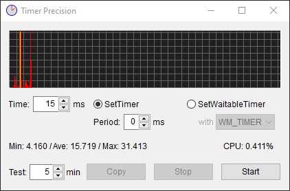](T15P0.txt) | `timeBeginPeriod` を呼ばなかった場合. 結構しんどそうです. 分解能が細かくないのに, かなり細かく散らかっているところを見ると, 「マジで間に合ってない」と思わせます. |
| [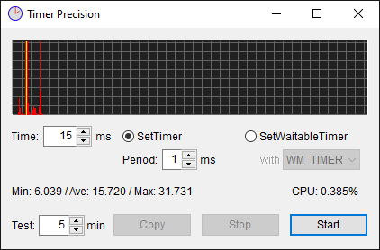](T15P1.txt) | `timeBeginPeriod(1)` とした場合. 大して変わりません. |

`timeBeginPeriod(1)` としてもブレるのが意外でしたが,
性能的にはゆとりのある [Client](../Client/README.md#15ms) 機でも似たような傾向があるので,
タイマーハンドラーの応答性というより, `WM_TIMER` の到着時刻自体にブレがあるように思えます.

`SetWaitbleTimer` での計測結果:

| 
画像
 | 注釈 |
| --- | --- |
|  | `WM_TIMER` で通知した場合. `SetTimer` より収束しています. あんなには散らかっていません. |
| [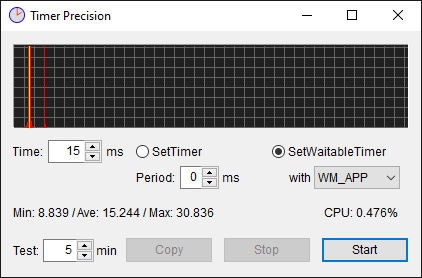](W15P0A.txt) | `WM_APP` で通知した場合. 上よりわずかにマシなような……. |
| [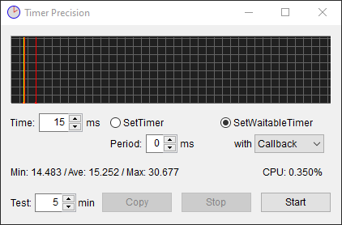](W15P0C.txt) | `Callback` とした場合. さらに収束しています. でも今一つ. |

`SetTimer` ではなく `SetWaitbleTimer` を選んだだけで, 如実にブレが減りました.
もうこれでいいような気もしますが, いちおう `timeBeginPeriod(1)` を加えた結果も並べると:

| 
画像
 | 注釈 |
| --- | --- |
| [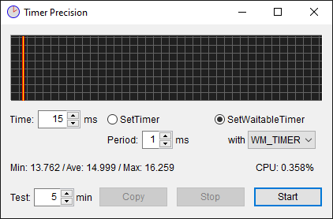](W15P1T.txt) | `WM_TIMER` で通知した場合. `timeBeginPeriod(1)` のおかげで ±1[ms] のブレで収まっています. |
|  | `WM_APP` で通知した場合. `timeBeginPeriod(1)`  のおかげで ±1[ms] のブレで収まっています. |
|  | `Callback` とした場合. `timeBeginPeriod(1)`  のおかげで ±1[ms] のブレで収まっています. |

とまあこんな感じで, `SetWaitbleTimer` だけで `timeBeginPeriod(1)` がないと,
“周回遅れ” ( `15.625[ms]`  後に来るピーク ) が生じます.
どれくらい生じるのか, ログ ( 画像をクリックすると現れます ) を検分すると,

| パターン | 状況 |
| --- | --- |
| `WM_TIMER` 通知 | 周回遅れの群: 99[回] / 15[ms] に近い群: 19578[回] ＝ 0.506[%] |
| `WM_APP` 通知 | 周回遅れの群: 87[回] / 15[ms] に近い群: 19589[回] ＝ 0.444[%] |
| `Callback` 通知 | 周回遅れの群: 102[回] / 15[ms] に近い群: 19562[回] ＝ 0.521[%] |

なんだ, 大したことないじゃないか…….

ということでやっぱり `timeBeginPeriod` を呼ぶ／呼ばないは些細な問題のように見えますが…….

### 16ms

`16[ms]` という数字は Windows の ( デフォルトの ) タイマー分解能である `15.625[ms]` ( 1000/64[s] ) を上回る長さです.
なので, タイマー待ち受け中に他のプロセスが割り込んでくるスキがあり, タイマー処理はブレるような気がするのですが……

`SetTimer` での計測結果:

| 
画像
 | 注釈 |
| --- | --- |
|  | `timeBeginPeriod` を呼ばなかった場合. 16[ms] のラインに乗った回数より, `15.625[ms]` x 1 分出遅れた 31[ms] や 32[ms] に流された回数の方が多い有様です. `15.625[ms]` x 2 分も結構出ています. |
| [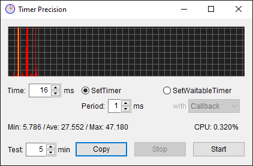](T16P1.txt) | `timeBeginPeriod(1)` とした場合. 大して効果がありません. |

`timeBeginPeriod` しようがしまいが大して変わりません.
一応 `15.625[ms]` 周期の傾向は読めますが, 1[ms] 単位のブレも多々あります.
( 画像をクリックしてログを見ると判ります. )
やはり `SetTimer` が届けてくれる `WM_TIMER` の到着時刻そのものがブレているような気がしますね.
運行がルーズな便のように見えます.
こんなことでは西村京太郎先生のトリックには使えません.

`SetWaitbleTimer` での計測結果:

| 
画像
 | 注釈 |
| --- | --- |
| [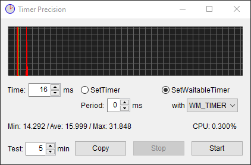](W16P0T.txt) | `WM_TIMER` で通知した場合. やはり「次の`15.625[ms]`」にある程度流れています. |
| [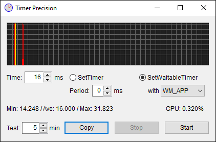](W16P0A.txt) | `WM_APP` で通知した場合. 上と大して違いません. |
|  | `Callback` とした場合. 上と大して違いません. |

`SetTimer` と比べればだいぶマシな `SetWaitbleTimer` ですが, やはり「次の`15.625[ms]`」に流れる回があります.

この状況に対し, `timeBeginPeriod(1)` を加えてみると:

| 
画像
 | 注釈 |
| --- | --- |
|  | `WM_TIMER` で通知した場合. `timeBeginPeriod(1)` のお陰で ±1[ms] に収束しました. |
|  | `WM_APP` で通知した場合. `timeBeginPeriod(1)` のお陰で ±1[ms] に収束しました. |
|  | `Callback` とした場合. `timeBeginPeriod(1)` のお陰で ±1[ms] に収束しました. |

とまあこんな感じで, `timeBeginPeriod(1)` の重要性がよく判りますが,
それも `SetWaitbleTimer` であればこその話で, `SetTimer` ではどうにもなりません.

### 100ms

15[ms] や 16[ms] などという限界に近い値ではなく, もう少し常識的な数字として 100[ms] を試してみました.

`100[ms]` という数字は Windows の ( デフォルトの ) タイマー分解能である `15.625[ms]` ( 1000/64[s] ) で割り切れない
( 100÷15.625＝6.4 となるので余りが出る ) 数字なので, 狙った時間には命中しないような気がするのですが……

`SetTimer` での計測結果:

| 
画像
 | 注釈 |
| --- | --- |
| [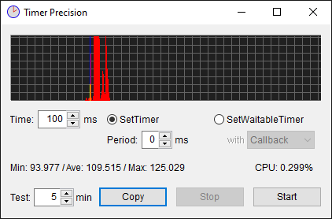](T100P0.txt) | `timeBeginPeriod` を呼ばなかった場合. ピークは 105[ms] にあります. `15.625[ms]` の周期にも乗っていません. |
| [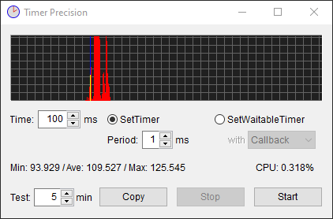](T100P1.txt) | `timeBeginPeriod(1)` とした場合. 上と同様の散らかり具合です. |

両方ともピークが 105[ms] にあるんですが, これは何なんですかね?
`15.625[ms]` x 6 = 93.750[ms] と `15.625[ms]` x 7 = 109.375[ms] の間にある中途半端な数字です.
速くなるとは考えづらいので, やはり 93.75[ms] の便が 11.25[ms] 遅れて来たと考えるべきなのでしょうか.
そんなルーズな運行では, やはり西村京太郎先生のトリックには使えません.

`SetWaitbleTimer` での計測結果:

| 
画像
 | 注釈 |
| --- | --- |
| [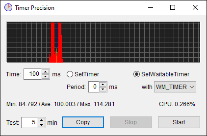](W100P0T.txt) | `WM_TIMER` で通知した場合. 興味深い絵柄を描いていますが, ブレは大きくなっています. ログを見る限りピークは 105[ms] にあります. |
| [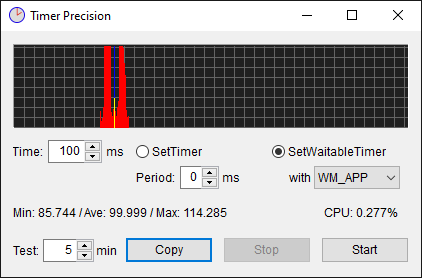](W100P0A.txt) | `WM_APP` で通知した場合. 上と大して違いません. |
|  | `Callback` とした場合. 上と大して違いません. |

もはや `15.625[ms]` 周期には見えません.
そしていずれもピークが 105[ms] にピークがあります.

タイマー値が長くなった分, 他プロセスが割り込むスキが増えたかのような構図になっています.

この状況に対し, `timeBeginPeriod(1)` を加えてみると:

| 
画像
 | 注釈 |
| --- | --- |
|  | `WM_TIMER` で通知した場合. `timeBeginPeriod(1)` のお陰で ±1[ms] に収束しました. |
|  | `WM_APP` で通知した場合. `timeBeginPeriod(1)` のお陰で ±1[ms] に収束しました. |
| [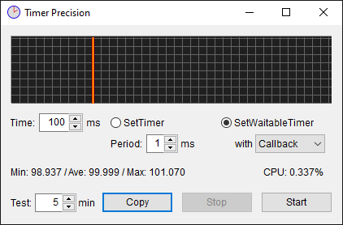](W100P1C.txt) | `Callback` とした場合. `timeBeginPeriod(1)` のお陰で ±1[ms] に収束しました. |

とまあこんな感じで, 16[ms] のときと同様, ±1[ms] の範囲に収束します.

### 125ms

`15.625[ms]` で割り切れる数字として 125[ms] を試してみました.
この倍数である 250[ms], 500[ms], 1[s] も同様の状況となるでしょう.

`125[ms]` という数字は Windows の ( デフォルトの ) タイマー分解能である `15.625[ms]` ( 1000/64[s] ) で割り切れる
( 125÷15.625＝8 となるので余りが出ない ) 数字なので, 狙った時間に命中しやすいような気がするのですが……

`SetTimer` での計測結果:

| 
画像
 | 注釈 |
| --- | --- |
| [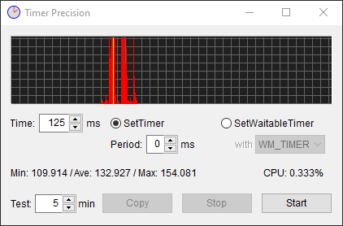](T125P0.txt) | `timeBeginPeriod` を呼ばなかった場合. 125[ms] がいちばん大きなピーク……じゃないですね. なぜか 135[ms] がピークです. その他に 120[ms], 136[ms, 150[ms] にも小さなピーク. |
| [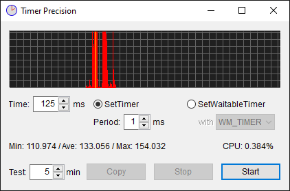](T125P1.txt) | `timeBeginPeriod(1)` とした場合. 上と同じような傾向です. |

`SetWaitbleTimer` での計測結果:

| 
画像
 | 注釈 |
| --- | --- |
| [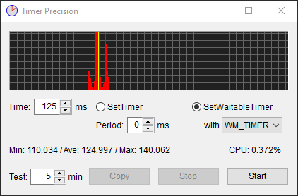](W125P0T.txt) | `WM_TIMER` で通知した場合. ピークは 120[ms] ですね. 135[ms] にも小さなピーク. |
| [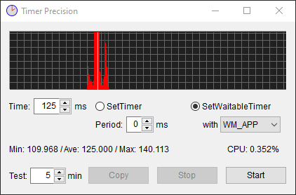](W125P0A.txt) | `WM_APP` で通知した場合. 上と大して違いません. |
| [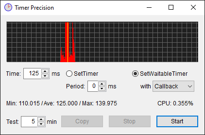](W125P0C.txt) | `Callback` とした場合. 上と大して違いません. |

`15.625[ms]` で割り切れるのに, 命中率が良くありません.
コア数が少ない割に乗ってくるプロセス数が多いので,
先を越されたり, 最悪次の `15.625[ms]` を待つハメになったりするのでしょうかね.

この状況に対し, `timeBeginPeriod(1)` を加えてみると:

| 
画像
 | 注釈 |
| --- | --- |
|  | `WM_TIMER` で通知した場合. `timeBeginPeriod(1)` のお陰で ±1[ms] に収束しました. |
| [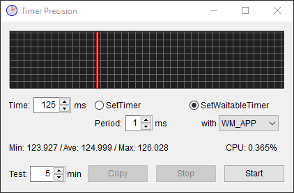](W125P1A.txt) | `WM_APP` で通知した場合. `timeBeginPeriod(1)` のお陰で ±1[ms] に収束しました. |
| [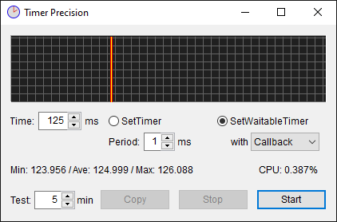](W125P1C.txt) | `Callback` とした場合. `timeBeginPeriod(1)` のお陰で ±1[ms] に収束しました. |

とまあこんな感じで, やっぱり ±1[ms] の範囲に収束します.
別プロセスに先を越される確率が減ったんでしょうか.
1/15.625 ぐらいに.

こう見ると, 結局 `timeBeginPeriod(1)` はあった方が良さそうです.

## 結論

非力 ( コア数が少ない ) でヒマじゃない ( バックグラウンドで走っているプロセスが多い ) PC こそ,
タイマーの精度にとっては `timeBeginPeriod(1)` の重要性が高いということのようです.

いや, 非力でヒマじゃないんだから, そんな CPU 使用率が上がるようなこと言われても困るんですけどね.

In-house Tool / 家中 徹

