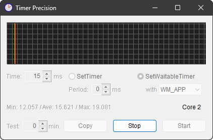
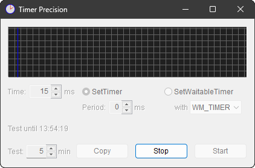

# TP

タイマーの精度をみるための「テストプログラム」です.

<picture>
  
</picture>

別件で[「短いタイマー値を使うアプリ」](../Bulletin/README.md) を作っている最中に,
タイマーの動作の正確さに疑問が生じたので,
タイマーの満了時間を計測するために作ったテストプログラムです.
( 用が済んだら使い捨てにするつもりで “TP” などという心のこもっていない名前で作り始めたのですが,
色々機能を付け足していくうちに, 捨てるのがもったいないアプリになったので,
名前も“Timer Precision”の略だったということにして, 保存版としました. )

要はタイマーのブレ具合を確認したかったんです.
数字の羅列で結果を出されても見るのがつらいので, 視覚的に判りやすいグラフ表示にしてみたんです.

本アプリは, 一度仕掛けた周期 ( 繰り返し ) タイマーのブレを計測するものです.
都度タイマーを仕掛け直して一回一回を計測するようなことはしていません.
Windows のタイマーそれ自体の精度を見たいのではなく,
タイマー処理全体を通してのブレを見たかったんです.

## 運用

タイマー値を選んで `Start` すると,

| 軸 | 意味 |
| --- | --- |
| 横軸 | 実際にタイマーが満了した(とアプリが認識した)経過時間 ( 1pixel で 1[ms] の分解能 ) | 
| 縦軸 | 実際にタイマーが満了した(とアプリが認識した)合計回数 ( 1pixel で 1[回] ) | 

というグラフを更新していきます.

要は[ヒストグラム](https://ja.wikipedia.org/wiki/ヒストグラム)なんですが,
グラフの縦幅は大きくなく, 縦棒の高さを見極めようというノリではありません.
むしろ[クロマトグラフィー](https://ja.wikipedia.org/wiki/クロマトグラフィー)のように,
どこにどれだけの縦棒が現われるかを見ようというノリです.

時間の分解能も [ms] 単位に丸めています. この TP としてはそんなもんで十分なので.
( いちおうソースを小細工すると[μS] 単位でのグラフが描け,
それはそれで興味深い絵柄が見えてきたりするのですが,
ここでの目的はあくまで [ms] 単位としています. )

で, 計測の条件を下表のように設定できます.

| 項目 | 意味 |
| --- | --- |
| `Time:` | タイマー値 / [ms] 単位 | 
| `SetTimer` | [`SetTimer`](https://learn.microsoft.com/en-us/windows/win32/api/winuser/nf-winuser-settimer) のブレを計測. | 
| `SetWaitableTimer` | [`SetWaitableTimer`](https://learn.microsoft.com/en-us/windows/win32/api/synchapi/nf-synchapi-setwaitabletimer) のブレを計測. | 
| `Period:` | [`timeBeginPeriod`](https://learn.microsoft.com/en-us/windows/win32/api/timeapi/nf-timeapi-timebeginperiod) に渡す分解能値. 0 で無効. |
| `with` | `SetWaitableTimer` のタイマ満了を通知する方式. `WM_TIMER`, `WM_APP`, `Callback` の 3種類. |

少し解りにくいのが, `SetWaitableTimer` のときに選べる通知方式の選択肢ですかね.
`SetWaitableTimer`を使用した場合, タイマ満了を検出するのはメインスレッドとは別口の専用スレッドとなります.
ここで選べる選択肢は, メインスレッドへタイマ満了を知らせる手段として, 以下の選択肢が試せるということです.

1. タイマースレッドからメインスレッドへ `WM_TIMER` を [`PostMessage`](https://learn.microsoft.com/en-us/windows/win32/api/winuser/nf-winuser-postmessagew).
1. タイマースレッドからメインスレッドへ `WM_APP` を [`PostMessage`](https://learn.microsoft.com/en-us/windows/win32/api/winuser/nf-winuser-postmessagew).
1. タイマースレッドからメインスレッドのコールバック関数を呼ぶ.

[`SendMessage`](https://learn.microsoft.com/en-us/windows/win32/api/winuser/nf-winuser-sendmessagew) を使う選択肢は用意しておりません.
「それ使うぐらいだったらコールバック呼べよ」という横着です.
というか, `SendMessage` してしまうと,
メインスレッドがその受領処理を完了させるまでタイマースレッドの進行も止まるので,
計測値が狂いやすいんです.

あと, 同じ [`PostMessage`](https://learn.microsoft.com/en-us/windows/win32/api/winuser/nf-winuser-postmessagew) を使うのに,
なんで　`WM_TIMER` と `WM_APP` という二つの選択肢が用意されているのかというと,
[`WM_TIMER`](https://learn.microsoft.com/en-us/windows/win32/winmsg/wm-timer) メッセージは扱いの優先度が低い
( [メッセージキューに他のメッセージが残っているうちは届かない](
https://learn.microsoft.com/en-us/windows/win32/winmsg/about-messages-and-message-queues#queued-messages) )
とかいう Windows の仕様の影響がいかほどのものか見てみたかったからです.

で, 計測完了後にタイマー条件設定の下に表れるのが, 下記の数値です.

| 項目 | 意味 |
| --- | --- |
| `Min:` | タイマー満了(とアプリが認識した)時間の最小値 ( [ms] 表記で小数点以下3位までの [μS] 単位 ) | 
| `Ave:` | タイマー満了(とアプリが認識した)時間の平均値 ( [ms] 表記で小数点以下3位までの [μS] 単位 ) | 
| `Max:` | タイマー満了(とアプリが認識した)時間の最大値 ( [ms] 表記で小数点以下3位までの [μS] 単位 ) | 
| `CPU:` | 計測処理中に本アプリが占有した CPU 使用率 | 

CPU 使用率は, オマケの項目みたいなもんですが, 
[`timeBeginPeriod`](https://learn.microsoft.com/en-us/windows/win32/api/timeapi/nf-timeapi-timebeginperiod)
を使うと CPU 使用率が増すという話を聞いたので, 影響がいかほどか見てみたかったんです.

そしていちばん下にあるのが, 計測を操る下表のものです.

| 項目 | 意味 |
| --- | --- |
| `Test:` | テスト時間. 指定された時間 ( [分] 単位 ) で計測を終了. `0` なら `Stop` するまで継続. |
| `Copy` | テスト結果の copy. メモ帳などに paste して利用可能. |
| `Stop` | テストの終了. |
| `Start` | テストの開始. |

テスト時間を指定できるようにしたのは, 異なる PC で同じ時間テストしたり, 同じ PC 上でも条件を変えてテストしたりして,
結果を見比べるときに便利だからです.
「せめて1分は粘れよ」という趣旨で, [分] 単位の指定としています.

`Copy` でクリップボードに入るデータは, テスト条件とテスト結果のサマリーが 1行目,
2行目以降はどの時間軸に何回入ったかを示す数字の羅列です.
2行目以下を Excel に paste して, Excel にグラフを描かせるのも手ですが,
その場合は「散布図」( scatter chart ) で描かせてください.
1回も入っていない時間軸のデータは省略しているので, 棒グラフ ( bar chart ) には向きません.

条件を選んで `Start` ボタンを押した後, 計測中の表示は下図のようになります.

<picture>
  
</picture>

CPU 使用率が出る予定の箇所に `Core` と出ていますが,
これはタイマー満了を通知されて動いた処理が, どのコア ( 論理プロセッサー ) 上で稼働しているかを表示しています.
`SetTimer` でやっているとこのコアの番号が入れ替わるのが見えることがあります.
Windows の `SetTimer` の通知元って, そんな風に入り乱れたりするんですね.
ちなみに, `SetWaitableTimer` でやっている場合は, 計測中のコアの入れ替わりはありません.
計測開始時に作られたスレッドが, 一貫して担当を続けるからです.

ただ, 「なんで Core 2 でやるんだよ！ Core 15 とか, もっとヒマそうなやつが居るだろ！」などと観客席からヤジを飛ばしたくなるのは,
いずれの方式でも同じです. ( どのコアがヒマそうなのかは,
[Resource Monitor](https://en.wikipedia.org/wiki/Resource_Monitor) の CPU タブでご確認ください. )
どのコアを使うのかは Windows の采配次第になっていて, `Start` を押すたびに出る目が違うことになります.
「コアガチャ」とでも呼びたくなるような状況です.
忙しく稼働しているプロセスが同居しているコアをつかまされた場合は, 計測結果の数字も悪くなります.
( かといって, [`SetThreadAffinityMask`](https://learn.microsoft.com/en-us/windows/win32/api/winbase/nf-winbase-setthreadaffinitymask) とかするのも,
実際のアプリの動作としてはリアリティーに欠けるし. )

ということで, 本アプリが弾き出す計測結果は, テストするたびに微妙に ( まれに大幅に ) 異なる場合があります.
ある程度のテスト時間である程度のテスト回数を重ねないと, 傾向を見切ったとは判断できません.

Windows の置かれた状況によっても計測結果はブレます.
ウェブの動画を眺めているブラウザが居たりすると, かなり数字は悪くなります.
PC の性能も数字に響きます. コア数の多いプロセッサーが有利です.
搭載メモリが少なくて HDD ( SSD ) に swap out が生じるような PC は論外です.

このブレを少しでも減らすため, `Test:` でテスト時間を指定した場合は, 下記のように計測中の表示更新をサボります.

<picture>
  
</picture>

まあ, 気休め程度のものかもしれませんが,
計測以外の処理を一切サボるので, 計測結果がより正確になるような気がします.

あと, このモードの場合, テスト終了時にお知らせの音が鳴ります.

## 環境

* Visual Studio 2022&reg; での Windows11 向け build なので, 64bit OS 用です.
* 同じ build で Windows10 でも問題なく動作しますが, 64bit 版に限ります.

## 動作

`Start` ボタンを押すと,
ダイアログ上で設定されたパラメーターをかき集めて, 指定された方のタイマーを起動します.

タイマーの計測処理は,

1. 「現在のカウント値」を[`QueryPerformanceCounter`](https://learn.microsoft.com/en-us/windows/win32/api/profileapi/nf-profileapi-queryperformancecounter)で得る.
1. 「前回のカウント値」との差分を「経過時間」とする.
1. 「経過時間」に基づいて最大値・最小値の更新を行う.
1. 「経過時間」を1[ms] 単位に四捨五入した数値をインデックスとして, グラフ用のカウンター配列を +1 する.
1. 「現在のカウント値」を次回に向けて「前回のカウント値」に格納しておく.

という軽い処理だけを行います.

で, `Test:` でテスト時間を指定していない場合,
この計測処理とは別口で 1[s] に 1[回],
最大値・最小値・平均値と, グラフの表示を更新します.
手っ取り早く傾向をつかみたい場合は, こっちの方がお手軽でしょう.

一方, `Test:` でテスト時間を指定した場合は,
表示をサボって計測のみに専念します.
その状態で手持ちの PC を計測してみた[実例](Examples/README.md)をまとめておきました.

## 追記

「[`timeBeginPeriod`](https://learn.microsoft.com/en-us/windows/win32/api/timeapi/nf-timeapi-timebeginperiod)
の影響については調べられるようだが、
[`NtSetTimerResolution`](https://www.google.com/search?q=NtSetTimerResolution)
については？」 
という疑問 (不満) を持たれた方もいらっしゃるかもしれませんが,

[`winmm.dll` の `timeBeginPeriod` を呼ぶと `ntdll.dll` の `NtSetTimerResolution` を呼ぶ構造になっている](https://mirrors.arcadecontrols.com/www.sysinternals.com/Information/HighResolutionTimers.html)

そうなので, 基本的に両者は同じものです.
`NtSetTimerResolution` を直接呼んだ方が, ほんのちょっぴり細かい指定 ( 0.5[ms] 単位 ) ができるのですが,
ここでは「1[ms]単位でじゅうぶん。」というスタンスで調査しているので,
興味はなかったんです.

「[`CreateTimerQueueTimer`](https://learn.microsoft.com/en-us/windows/win32/api/threadpoollegacyapiset/nf-threadpoollegacyapiset-createtimerqueuetimer)
は？」 
[`SetWaitableTimer`](https://learn.microsoft.com/en-us/windows/win32/api/synchapi/nf-synchapi-setwaitabletimer) で
目的は果たしてしまったので, もういいです. ( なんか“legacy”とかヘッダー名にあるし. )

「[`MMCSS`](https://learn.microsoft.com/en-us/windows/win32/procthread/multimedia-class-scheduler-service)は？」 
[目的のアプリ](../Bulletin/README.md) がスケジューリングをいじってまで優遇するほどのものではないので, 本 TP としては手を出していません.
その辺の影響力を見てみたい方は, ご自分でソースをいじって機能を追加してみてください.

In-house Tool / 家中 徹

